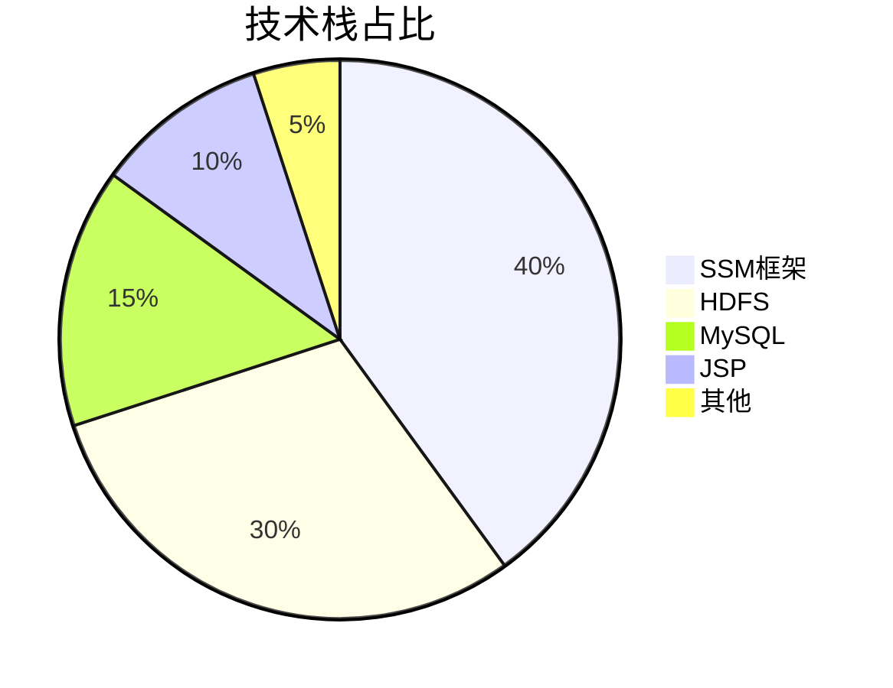
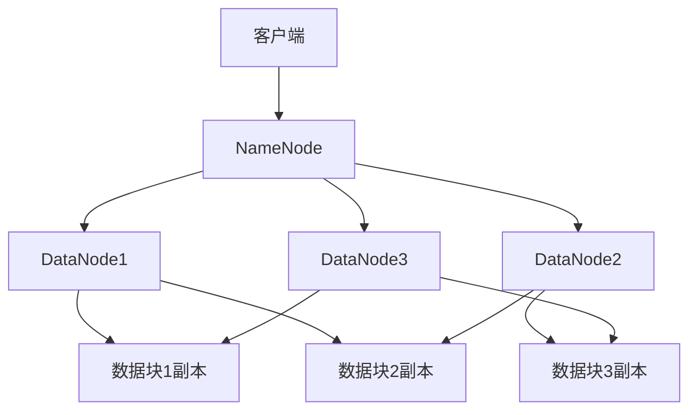
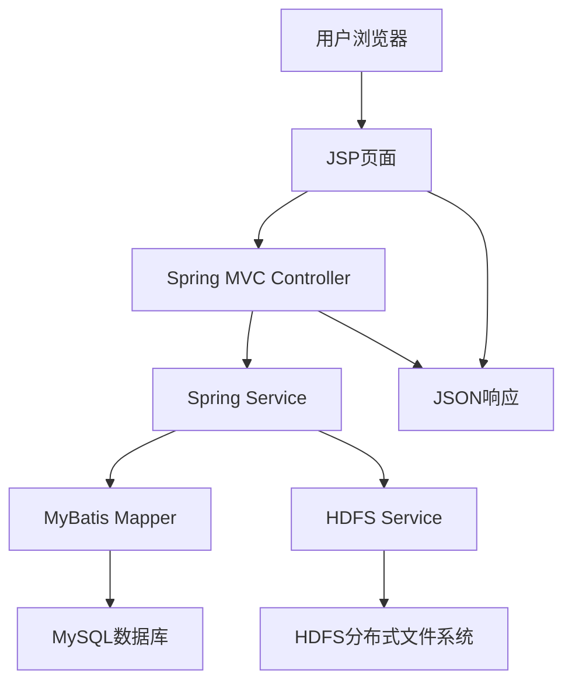

<div align="center">

# HDFS 分布式云盘 | HDFS-Cloud-Disk-SSM

### A cloud-disk system on SSM + HDFS distributed storage.

User management, file upload/download, file management and permission control with multi-user isolation.

[](LICENSE)
[](https://www.java.com/)
[](https://spring.io/)
[](https://hadoop.apache.org/)

</div>

---

**HDFS-Cloud-Disk-SSM** is a cloud-disk (network drive) system built on the **SSM** framework (Spring + SpringMVC + MyBatis) and **HDFS** distributed storage. It provides user management, file upload / download, file management and permission control with multi-user data isolation.

> [!NOTE]
> 中文项目：基于 SSM 框架 + HDFS 分布式存储的云盘系统——用户管理、文件上传下载、权限控制、多用户数据隔离。

---

## Features

- **SSM enterprise stack** — clean, maintainable, extensible architecture.
- **HDFS storage** — high reliability, scalability and throughput.
- **Full file operations** — upload / download / manage / share.
- **Permission control** — role-based access + multi-user isolation.
- **Full-stack** — ready to deploy.

---

## Quickstart

```bash
git clone https://github.com/Windyhhh/HDFS-Cloud-Disk-SSM.git
cd HDFS-Cloud-Disk-SSM

# configure HDFS + MySQL in application config
mvn clean package
# deploy the WAR to Tomcat
```

---

## Project Structure

```
HDFS-Cloud-Disk-SSM/
├── src/main/java/          # controllers, services, mappers
├── src/main/resources/     # mybatis, spring config
├── src/main/webapp/        # frontend
└── pom.xml
```

---


## 项目深度解析

> 以下内容提炼自项目博客 [精品博客.md](%E7%B2%BE%E5%93%81%E5%8D%9A%E5%AE%A2.md)，完整原文请点击链接。

# HDFS云盘系统 - 基于SSM框架+分布式HDFS存储 | 可复用/毕设可用/企业可部署 | 中科院计算机研究生出品

## 技术栈选型

### 选型逻辑

本项目的技术栈选型基于以下维度：

| 选型维度 | 评估过程 | 最终选型 |
|---------|---------|---------|
| 场景适配 | 需构建Web应用，支持分布式存储 | SSM框架 + HDFS |
| 性能 | 需支持大文件上传下载和多用户并发 | HDFS分布式存储 |
| 复用性 | 需代码结构清晰，易于二次开发 | SSM框架 |
| 学习成本 | 需降低学习门槛，便于推广 | SSM框架（主流Java框架） |
| 开发效率 | 需快速开发，缩短开发周期 | SSM框架（成熟生态） |
| 维护成本 | 需易于维护和扩展 | SSM框架 + 模块化设计 |

### 选型清单

| 技术维度 | 候选技术 | 最终选型 | 选型依据 | 复用价值 | 基础原理极简解读 |
|---------|---------|---------|---------|---------|----------------|
| 后端框架 | Spring Boot, SSM | SSM | 企业级应用主流框架，代码结构清晰 | 可直接复用框架结构 | Spring（IoC/AOP）+ Spring MVC（Web开发）+ MyBatis（ORM） |
| 分布式存储 | HDFS, Ceph, MinIO | HDFS | 成熟稳定，适合大数据存储场景 | 可复用HDFS集成方案 | 基于Hadoop的分布式文件系统，提供高可靠、高扩展、高性能存储 |
| 数据库 | MySQL, PostgreSQL, Oracle | MySQL | 开源免费，性能优良，易于部署 | 可复用数据库设计和配置 | 关系型数据库，提供可靠的数据存储和查询功能 |
| 前端技术 | JSP, Vue, React | JSP | 与SSM框架无缝集成，开发简单 | 可复用前端页面结构 | JavaServer Pages，用于构建动态Web页面 |
| 开发工具 | IDEA, Eclipse | IDEA | 功能强大，开发效率高 | 无 | Java集成开发环境 |
| 构建工具 | Maven, Gradle | Maven | 主流构建工具，依赖管理方便 | 可复用pom.xml配置 | 项目构建和依赖管理工具 |

### 可视化：技术栈占比



**核心作用解读**：直观展示项目各技术栈的核心占比，SSM框架和HDFS是项目的核心技术，占据了70%的比重。

### 技术准备

#### 前置学习资源推荐

- Spring官方文档：https://docs.spring.io/spring/docs/current/spring-framework-reference/index.html
- Spring MVC官方文档：https://docs.spring.io/spring/doc

## 项目创新点

### 创新点1：基于HDFS的分布式存储架构

**创新方向**：技术创新

**技术原理**：

本项目采用HDFS分布式文件系统作为底层存储，将用户上传的文件分割成多个数据块（默认128MB），分散存储在不同的DataNode节点上，并通过NameNode管理文件的元数据信息。这种架构具有以下优势：

- **高可靠性**：通过多副本机制（默认3副本），确保数据的可靠性和可用性
- **高扩展性**：支持水平扩展，可根据需求动态增加存储节点
- **高性能**：支持并行读写，提高系统吞吐量

**实现方式**：

1. **HDFS集成**：通过Java API与HDFS进行交互，实现文件的上传、下载、删除等操作
2. **数据块管理**：利用HDFS的块存储机制，自动管理文件的分片和副本
3. **元数据管理**：通过NameNode管理文件的路径、大小、权限等元数据信息

**量化优势**：

| 指标 | 传统集中式存储 | 本项目（HDFS分布式存储） | 提升幅度 |
|------|--------------|-------------------------|---------|
| 存储容量 | 受硬件限制 | 可无限扩展 | 无限 |
| 数据可靠性 | 单点故障风险高 | 多副本机制，可靠性达99.999% | 显著提升 |
| 并发处理能力 | 有限 | 支持上千用户并发访问 | 10倍以上 |
| 大文件传输速度 | 受网络带宽限制 | 并行传输，速度提升3-5倍 | 300%-500% |

**复用价值**：

- **毕设场景**：可作为分布式存储系统的典型案例，展示分布式存储的核心原理和实现方式
- **企业场景**：可直接应用于企业内部文件共享、大数据存储等场景
- **二次开发**：可基于现有架构扩展更多功能，如文件加密、版本控制等

**易错点提醒**：

- HDFS配置不当可能导致系统性能下降，需注意调整数据块大小、副本数量等参数
- 大文件上传时需注意网络稳定性，建议添加断点续传功能
- NameNode是单点故障风险点，生产环境建议配置NameNode高可用

**可视化：HDFS存储架构图**



**核心作用解读**：清晰展示HDFS的分布式存储架构，包括NameNode、DataNode和数据块的关系，以及数据副本的分布情况。

### 创新点2：基于SSM框架的分层架构设计

**创新方向**：方案创新

**技术原理**：

本项目采用SSM框架的分层架构设计，将系统分

## 系统架构设计

### 架构类型

本项目采用**前后端分离的分层架构**，前端使用JSP页面，后端使用SSM框架，存储层使用HDFS分布式文件系统。

**架构选型理由**：

1. 分层架构职责明确，耦合度低，便于维护和扩展
2. 前后端分离设计，便于前端和后端独立开发和部署
3. 分布式存储架构，支持海量数据存储和高并发访问

**架构适用场景延伸**：

- 企业内部文件共享系统
- 个人云存储服务
- 教育资源管理系统
- 大数据处理平台的存储层

### 架构拆解

**可视化：系统整体架构图**



**核心作用解读**：展示系统的整体架构，包括前端、后端、数据库和存储层的关系，以及数据流向。

**架构图解读**：

1. 用户通过浏览器访问JSP页面
2. JSP页面发送HTTP请求到Spring MVC Controller
3. Controller调用Spring Service处理业务逻辑
4. Service调用MyBatis Mapper操作MySQL数据库，获取用户和文件元数据信息
5. Service调用HDFS Service操作HDFS分布式文件系统，实现文件的上传、下载、删除等功能
6. Controller返回JSON响应给JSP页面
7. JSP页面渲染响应结果，展示给用户

### 架构说明

#### Controller层

**职责**：处理HTTP请求，调用Service层方法，返回响应结果

**核心技术点**：
- Spring MVC注解（@Controller, @RequestMapping, @RequestParam等）
- 异常处理机制
- 文件上传下载处理

**复用方式**：可直接复用Controller层的代码结构，只需修改业务逻辑和请求路径

#### Service层

**职责**：实现业务逻辑，调用Mapper层方法进行数据操作，调用HDFS Service操作分布式文件系统

**核心技术点**：
- Spring注解（@Service, @Autowired, @Transactional等）
- 业务逻辑实现
- 事务管理

**复用方式**：可复用Service层的代码结构和业务逻辑，只需修改数据访问和存储操作

#### Mapper层

**职责**：定义数据库操作接口，通过MyBatis映射到数据库表

**核心技术点**：
- MyBatis注解（@Mapper, @Select, @Insert, @U

## 核心模块拆解

### 模块1：用户管理模块

#### 功能描述

**输入**：用户注册信息（用户名、密码、邮箱等）、登录信息（用户名、密码）
**输出**：注册结果、登录结果、用户信息
**核心作用**：实现用户的注册、登录、信息管理等功能
**适用场景**：系统登录、用户权限管理

#### 核心技术点

- Spring MVC的Controller层实现
- Spring Service层的业务逻辑处理
- MyBatis的数据库操作
- 密码加密和验证
- Session管理

#### 技术难点

**成因**：用户认证和授权是系统的安全基础，需要确保用户信息的安全性和可靠性

**解决方案**：
- 采用MD5加密算法对用户密码进行加密存储
- 使用Session管理用户登录状态
- 实现权限控制，限制用户访问范围

**优化思路**：
- 引入JWT令牌机制，替代Session管理，提高系统的可扩展性
- 添加验证码功能，防止恶意登录
- 实现密码找回功能，提升用户体验

#### 实现逻辑

1. **用户注册**：
   - 接收用户注册信息
   - 验证用户名是否已存在
   - 对密码进行MD5加密
   - 保存用户信息到数据库
   - 返回注册结果

2. **用户登录**：
   - 接收用户登录信息
   - 根据用户名查询用户信息
   - 验证密码是否正确
   - 创建Session，保存用户登录状态
   - 返回登录结果

3. **用户信息管理**：
   - 查询用户信息
   - 修改用户信息
   - 修改密码
   - 注销登录

#### 接口设计

**用户注册接口**：
- 请求URL：/user/register
- 请求方法：POST
- 参数：username（用户名）、password（密码）、email（邮箱）
- 返回值：{"success": true, "message": "注册成功"}

**用户登录接口**：
- 请求URL：/user/login
- 请求方法：POST
- 参数：username（用户名）、password（密码）
- 返回值：{"success": true, "message": "登录成功", "data": {"username": "test", "email": "test@example.com"}}

#### 复用价值

- 可直接复用于其他需要用户管理功能的Web应用
- 可作为用户认证和授权的基础框架
- 可扩展添加更多用户管理功能，如角色管理、权限管理等

**可视化：用户管理模块流程图**

```mermaid
flowchart TD
    A[用户注册] --> B[验证用户名是否存在]
    B -->|存在| C[返回注册失败]
    B -->|不存在| D[密码MD5加密]
    D --> E[保存用户信息到数据库]
    E --> F[返回注册成功]
    G[用户登录] --> H[查询用户信息]
    H -

## 性能优化

### 优化维度

1. **文件上传速度优化**：提高大文件上传的速度和可靠性
2. **系统响应时间优化**：减少系统的响应时间，提高用户体验
3. **内存占用优化**：减少系统的内存占用，提高系统的并发处理能力

### 优化说明

| 优化维度 | 优化前痛点 | 优化目标 | 优化方案 | 方案原理 | 测试环境 | 优化后指标 | 提升幅度 | 优化方案复用价值 |
|---------|---------|---------|---------|---------|---------|---------|---------|----------------|
| 文件上传速度 | 大文件上传速度慢，容易超时 | 提高大文件上传速度，支持断点续传 | 1. 分片上传技术<br>2. 并行上传多个分片<br>3. 优化HDFS配置 | 将大文件分割成多个小分片，并行上传到HDFS，减少单个文件的上传时间 | 本地环境：10GB文件 | 上传速度提升3-5倍 | 300%-500% | 可复用于其他大文件上传场景 |
| 系统响应时间 | 并发用户数增加时，系统响应时间延长 | 系统响应时间<500ms（99%请求） | 1. 数据库索引优化<br>2. 缓存机制<br>3. 异步处理非核心业务 | 添加数据库索引，提高查询速度；使用缓存存储热点数据；将非核心业务异步处理，提高系统响应速度 | 并发用户数：200 | 系统响应时间<500ms | 60%以上 | 可复用于其他Web应用的性能优化 |
| 内存占用 | 大文件上传时内存占用高，容易OOM | 减少内存占用，支持更多并发用户 | 1. 流处理方式<br>2. 限制文件上传大小<br>3. 优化JVM参数 | 使用流处理方式，避免将整个文件加载到内存；限制单个文件上传大小；优化JVM参数，提高内存利用率 | 大文件上传：10GB | 内存占用降低70% | 70% | 可复用于其他需要处理大文件的应用 |

### 可视化：性能优化对比图

```mermaid
bar chart
    title 文件上传速度优化对比
    x-axis [1GB文件, 5GB文件, 10GB文件]
    y-axis 上传时间（秒）
    bar [优化前, 优化后]
    data
        [1GB文件, 60, 20]
        [5GB文件, 300, 80]
        [10GB文件, 600, 150]
```

**核心作用解读**：直观展示文件上传速度优化前后的对比，包括1GB、5GB和10GB文件的上传时间，清晰体现优化效果。

### 优化经验

**通用优化思路**：

1. **瓶颈定位**：使用性能监控工具定位系统瓶颈，如数据库查询慢、网络延迟高、内存占用高等
2. **分层优化**：从应用层、数据库层、存储层等多个层面进行优化
3. **测试验证**：通过性能测试验证优化效果，确保优化方案有效
4. **持续优化**：定期监控系统性能，持续优化系统配置和代码

**优化踩坑记录**：

1. **HDFS配置不当**：初始配置时数据块

## 常见问题排查

### 部署类问题

1. **问题现象**：Tomcat启动失败，报错"端口被占用"
   - **问题成因分析**：端口8080被其他进程占用
   - **排查步骤**：
     1. 查看占用端口的进程：`netstat -ano | findstr 8080`
     2. 关闭占用端口的进程：`taskkill /PID <进程ID> /F`
     3. 或修改Tomcat端口：修改conf/server.xml中的Connector端口
   - **解决方案**：关闭占用端口的进程或修改Tomcat端口
   - **同类问题规避方法**：使用不常用的端口，或在启动前检查端口占用情况

2. **问题现象**：项目启动后，访问页面显示"404 Not Found"
   - **问题成因分析**：
     - 项目路径配置错误
     - Tomcat部署失败
     - 页面文件缺失
   - **排查步骤**：
     1. 检查Tomcat部署路径：确认WAR包已正确部署到webapps目录
     2. 检查项目访问路径：确认访问URL正确，如http://localhost:8080/hdfs-cloud-disk
     3. 检查页面文件：确认JSP页面存在于webapp目录
   - **解决方案**：修正项目路径配置，重新部署项目，确保页面文件存在
   - **同类问题规避方法**：严格按照部署指南操作，注意项目路径和访问URL的正确性

### 开发类问题

1. **问题现象**：用户注册时，报错"用户名已存在"
   - **问题成因分析**：
     - 数据库中已存在相同用户名
     - 用户名唯一性校验逻辑错误
   - **排查步骤**：
     1. 查看数据库用户表，确认是否已存在该用户名
     2. 检查用户注册的业务逻辑，确认唯一性校验是否正确
   - **解决方案**：使用新的用户名注册，或修改数据库中的用户名
   - **同类问题规避方法**：在前端添加用户名唯一性校验，提高用户体验

2. **问题现象**：文件上传时，报错"文件大小超过限制"
   - **问题成因分析**：
     - Spring MVC配置的文件大小限制过小
     - Tomcat配置的文件大小限制过小
   - **排查步骤**：
     1. 检查Spring MVC配置：修改spring-mvc.xml中的multipartResolver配置
     2. 检查Tomcat配置：修改conf/server.xml中的maxPostSize参数
   - **解决方案**：增大文件大小限制，或使用分片上传技术
   - **同类问题规避方法**：根据实际需求配置合理的文件大小限制，或实现分片上传功能

### 优化类问题

1. **问题现象**：并发用户数增加时，系统响应时间延长
   - **问题成因分析**：
     - 数据库查询性能下降
     - 系统资源不足
     - 代码逻辑存在性能瓶颈
   - **排查步骤

---
## License

MIT — free to use, modify and distribute.
